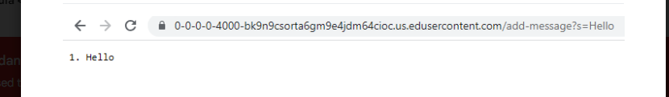
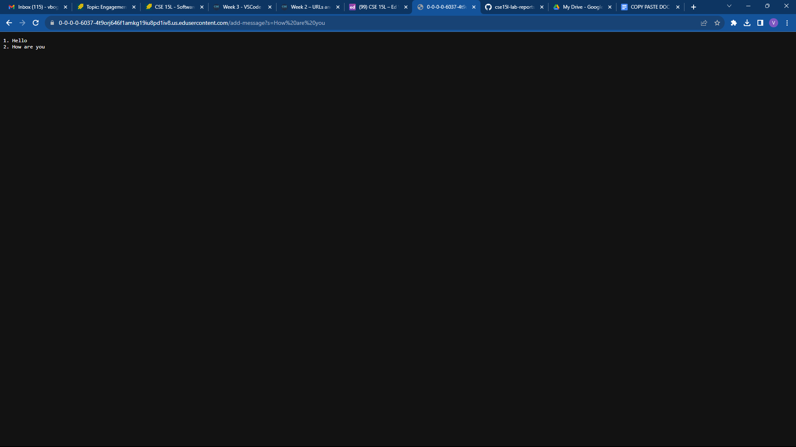
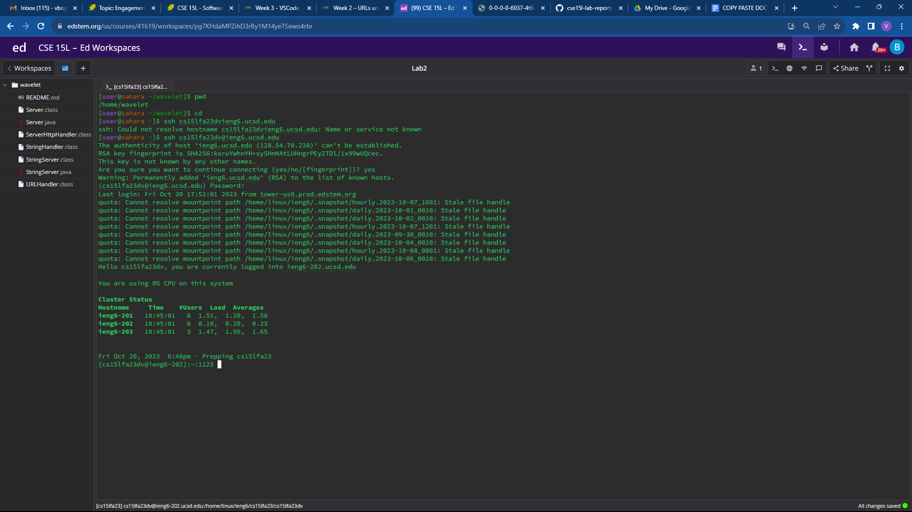
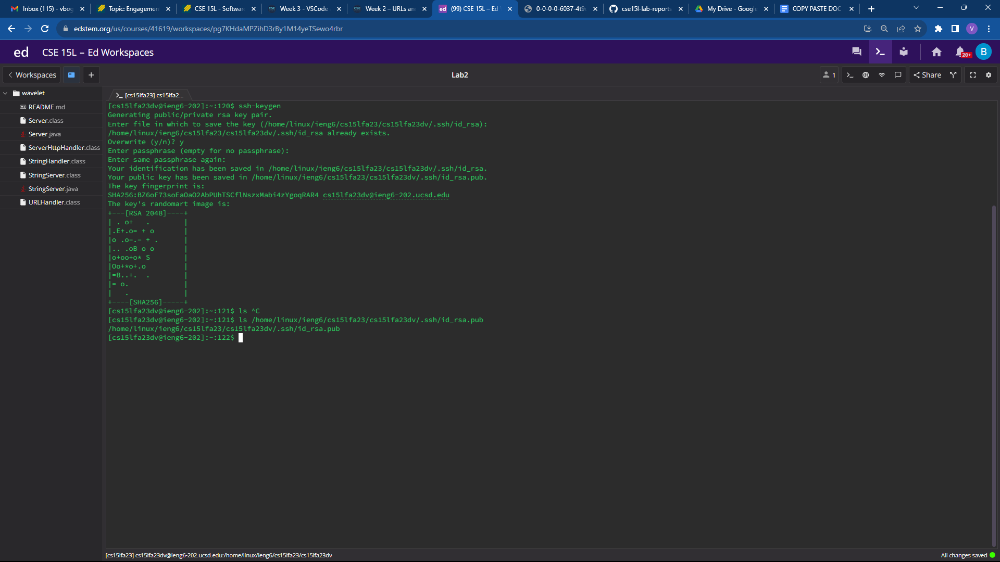
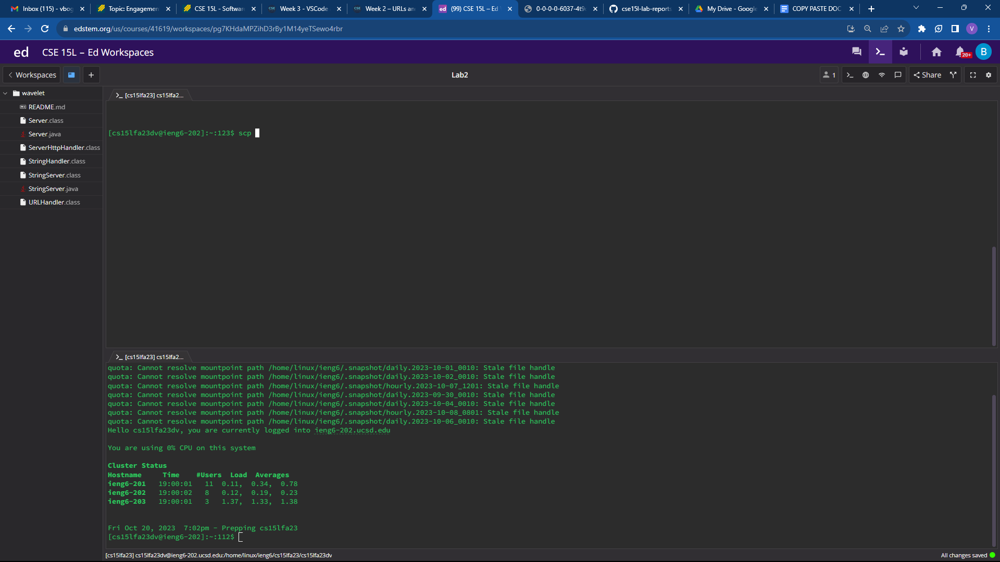
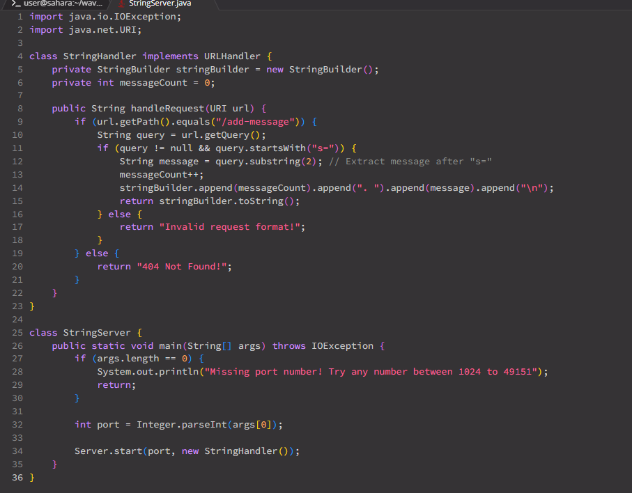

The handleRequest method and the main method are called
The main method has a String parameter named args , which is used to take in the port
number. The handleRequest method as a URI parameter named url which indexes the URL
up until the beginning of the path.
The value of the main method parameter is 4000 because that is the port number we set it
to. The value of the handleRequest ʼs parameter is localhost:
When I added the /add-message?s=Hello , cat command, counter command and others url is changed to
localhost:4000/add-message?s=Hello.

The stringhandler and handleRequestare the methods called in my code. 
The relevant methods are handleRequest(URI url) in the StringHandler class and the main(String[] args) method in the StringServer class.
In the StringHandler class, the relevant fields are stringBuilder and messageCount, which store the accumulated messages and the count of messages, respectively. The handleRequest method takes a URI object as an argument, allowing it to extract information from the incoming URL. The StringServer class mainly processes command line arguments but doesn't maintain any relevant fields for this specific functionality.
These changes occur because the request URL contains the query parameter s=hello. The handleRequest method extracts the message "hello" from the query parameter, increments the messageCount, and appends the formatted message to the stringBuilder.

Something that I learned in this week's lab was about directories and creating keys. I was pretty interested in the mkdir commands for the terminal as I didn't know that you could tranfer files between different systems. It was pretty cool how you could log in the terminal without using a password. 
