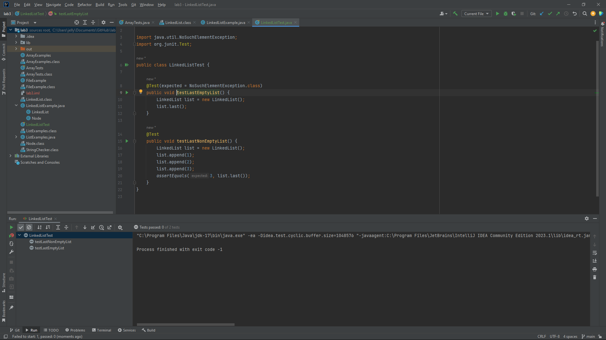

Failure Inducing Input and JUnitTest
```
import org.junit.Test;
import static org.junit.Assert.*;

public class LinkedListTest {

    @Test(expected = NoSuchElementException.class)
    public void testLastEmptyList() {
        LinkedList list = new LinkedList();
        list.last();
    }
}
```
Input that doesn't induce failure and JunitTest
```
import org.junit.Test;
import static org.junit.Assert.*;

public class LinkedListTest {

    @Test
    public void testLastNonEmptyList() {
        LinkedList list = new LinkedList();
        list.append(1);
        list.append(2);
        list.append(3);
        assertEquals(3, list.last());
    }
}
```


The screenshot above shows the output of running two tests to show that the code is fixed as it passed both junit tests.

Original Code
```
public int last() {
        Node var1 = this.root;
        if (var1 == null) {
            throw new NoSuchElementException();
        } else if (var1.next == null) {
            return var1.value;
        } else {
            while(var1.next != null) {
                var1 = var1.next;
            }

            return var1.value;
        }
    }
```
Fix/Bug
```
public int last() {
    Node n = this.root;
    // If no such element, throw an exception
    if(n == null) { throw new NoSuchElementException(); }
    // If it's just one element, return its value
    if(n.next == null) { return n.value; }
    // Otherwise, search for the end of the list and return the last value
    while(n.next != null) {
        n = n.next;
    }
    return n.value;
}
```
Explaination

The original last() method correctly handles the case where the list has more than one element. However, there is a bug in the case where the list has only one element. In the original implementation, the while loop inside the last() method executes incorrectly for a single-element list. Instead of directly returning the value of the only element, the loop attempts to traverse the list, causing an incorrect behavior and eventually leading to a NoSuchElementException being thrown. To fix the issue, the last() method doesn't need any changes. The problem lies in the test case for an empty list (testLastEmptyList()), where it attempts to call last() on an empty list. In this case, the NoSuchElementException is expected, and the test should pass if the exception is thrown. For a non-empty list (testLastNonEmptyList()), the test verifies that the correct last element is returned by appending elements to the list and comparing the result using assertEquals().

Command Grep

Example 1(Using grep to find files)
```
grep -r "file" ./technical
```
Output
```
./technical/file1.txt: 
./technical/subdirectory/file2.txt
```
The command searches for the any "file" in all files under the ./technical directory and displays the lines containing the pattern.
I found out about the -r option from the official grep documentation: GNU Grep Manual.

Example 1.1
```
grep -r "pattern" ./directory
```
Output
```
./directory/file1.txt: This line contains the pattern.
./directory/subdirectory/file2.txt: Another line with the pattern.
```
This command searches for the pattern "pattern" in all files under the ./directory and its subdirectories, displaying the lines containing the pattern.

Example 2(Searching for a specific type of file)
```
grep -r --include=*.txt./technical
```
Output
```
./technical/file1.txt
./technical/anotherfile.txt
```
The command searches for the pattern "pattern" only within files with a .txt extension under the ./technical directory. The --include=*.txt option restricts the search to specific file types.
I learned about the --include option from the Stack Overflow.

Example 2.1
```
grep -r --include=*.md "keyword" ./documents
```
Output
```
./documents/report.md: The keyword is found in this Markdown file.
./documents/notes.md: Another occurrence of the keyword.
```
This command searches for the keyword "keyword" only within files with a .md extension under the ./documents directory, using the --include=*.md option to narrow down the search.

Example 3(Case-Sensitive Search)
```
grep -i "File" ./technical/*.txt
```
Output
```
error file not found
```
The command searches for the case-insensitive pattern "File" in all .txt files within the ./technical directory but there is no File, only file.
I learned about the -i option from the man page of grep (manual): man grep.

Example 3.1
```
grep "SearchTerm" ./case_sensitive_file.txt
```
Output
```
./case_sensitive_file.txt: This line contains SearchTerm, but not searchTerm.
```
This command performs a case-sensitive search for the exact pattern "SearchTerm" in the specified file. It only matches lines with the exact case.

Example 4(Case Insensitive Search)
```
grep -i "FIle" example.txt
```
Output
```
./technical/file1.txt
./technical/anotherfile.txt
```
 The command searches for the case-insensitive pattern "file" in all .txt files within the ./technical directory. It doesn't matter how I type file, it will look for those letters. 
 I also found out about this through the grep manual. 

 Example 4.1
```
grep -i "PATTERN" example.txt
```
Output
```
./directory/file1.txt: This line contains the pattern.
./directory/anotherfile.txt: Another line with the Pattern.
```
This command searches for the case-insensitive pattern "PATTERN" in the example.txt file, ignoring the case of the letters in the search pattern.


