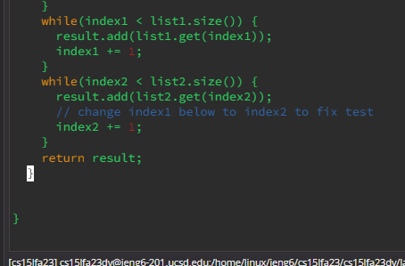
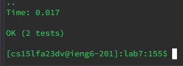
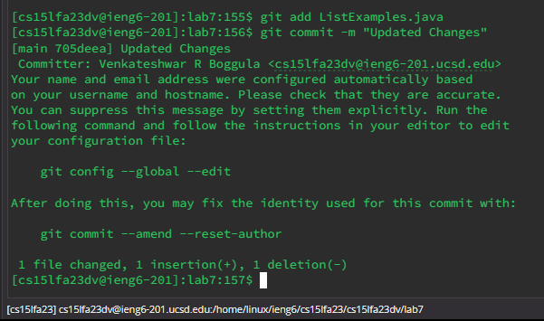

Logged into the server using the ieng6 account

Keys Pressed 
```
<up> <enter>
```

Cloning the fork of the repository from the github url

keys pressed
```
<ctrl> r g <enter>
```
control r is the easiest way to search through a command line recursively and fast in the command history


Running the tests to show that they failed

keys pressed
```
<up><up><up><up><up><up><enter> -cp .:lib/hamcrest-core-1.3.jar:lib/junit-4.13.2
<up><up><up><up><up><up><up><enter> -cp .:lib/hamcrest-core-1.3.jar:lib/junit-4.13.2.jar.0rg.junit.runner.JUnitCore
```
The command was 6 lines up, so by hitting the up arrow 6 times, you can access it and the other command it was one above that so by hitting the up arrow 7 times you can acess it from the same position. 


To access the image below you can type 
```
vim ListExamples.java
```

Editing the file to fix the error so that it can pass the test cases by changing index1 to index2

keys pressed
```
vim <shift> L <tab>, tab 43 j e r 2 <shift> :wq enter
```
You type in vim and then the file name you want to edit because that is how you edit a file through vim text editor which in this case is ListExamples.java and the rest of the keys are the edits required to reach index1 and change it to 2 while the :wq enter saves the changes.


This is to show that the tests now pass

keys pressed
```
bash test.sh <enter>
```
I typed out bash and the file name to run the tests to make sure the errors have been fixed. 



Commiting and pushing the changes onto a github account
keys pressed
```
<ctrl> r g i t c o <enter> g i t p <enter>
```
I used control r and control p and then enter to autofill the git commit and git push commands and then I typed out "Updated Changes" as a message to push the fixes to my github account. 
