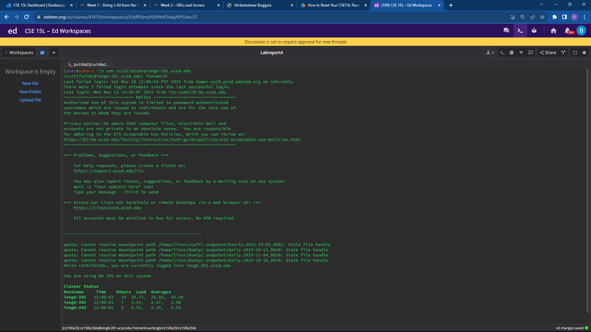
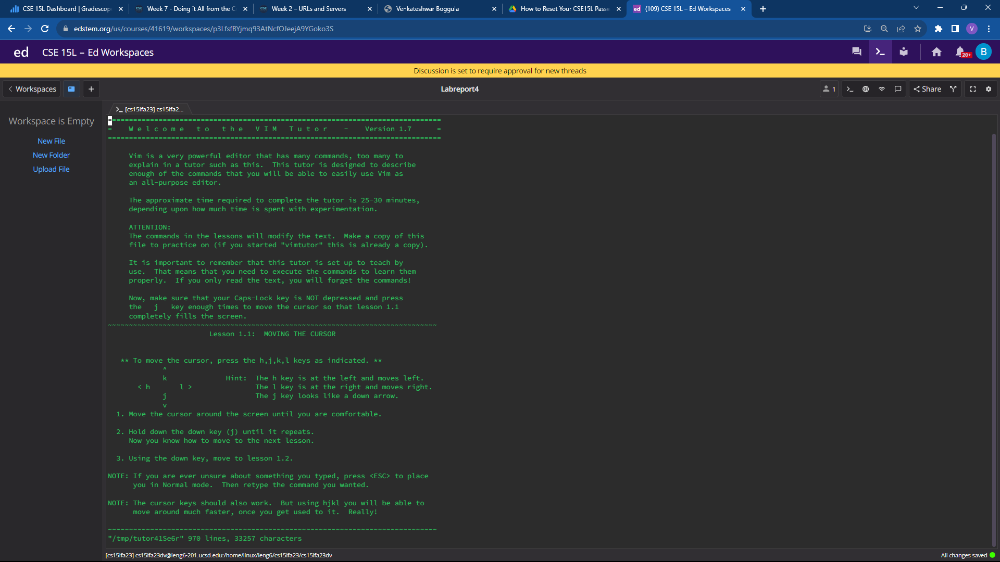
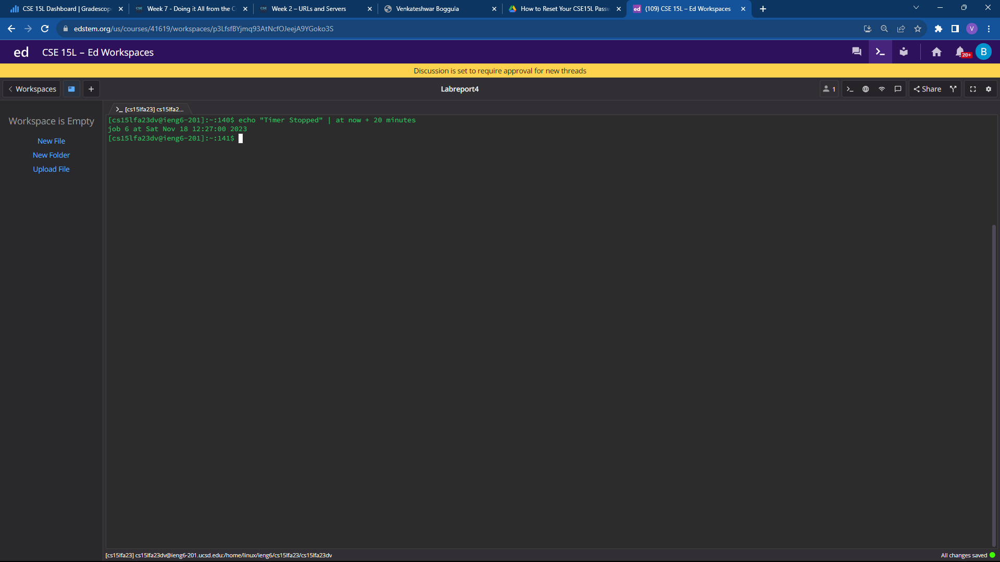
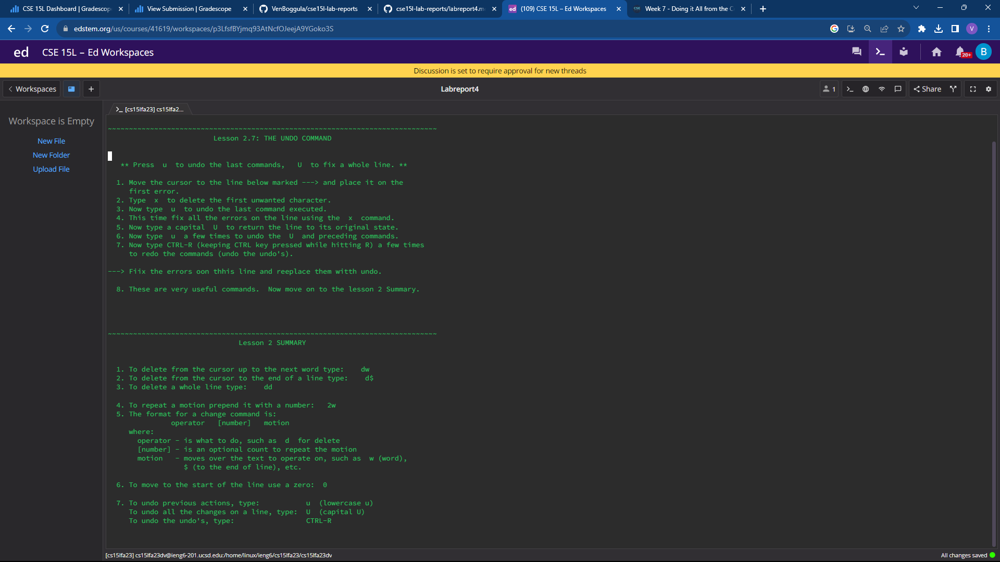
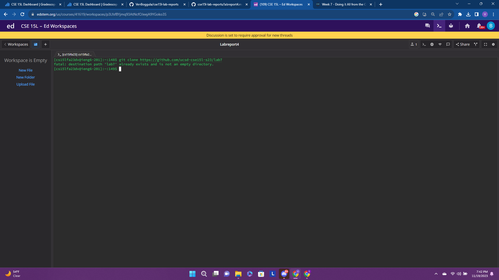

keys pressed
```
ssh username@ieng6
```
Logged into ieng6 using SSH.

keys pressed
```
vimtutor
```
Ran the vim tutorial

keys pressed
```
echo "Timer for 20 minutes" | at now + 20 minutes
```
Set a timer for 20 minutes

keys pressed
<j> A lot of times, <ESC>, <:q! ENTER>, <x> <backspace> 4 times, <i> ssing in, <a> ing here, <:wq> ENTER, <ESC> dw, d$ 3 times, <2w>, <3e>, <5w>,<4e>, <d2w>, <dd>, <2dd>, <U>
These are all the vim commands I learned and what I pressed during the vim tutorial. 


keys pressed
```
git clone https://github.com/ucsd-cse15l-s23/lab7
```
Clone the lab7 repository

keys pressed
```
<i>, 2 backspace
```
Changed index1 to index2 as specified in the instructions.
