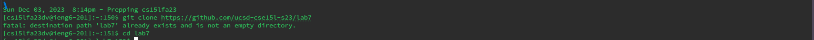

Logged into the server using the ieng6 account

Keys Pressed 
```
<up> <enter>
```

Cloning the fork of the repository from the github url
keys pressed
```
<ctrl> r g <enter>
```
control r is the easiest way to search through a command line recursively and fast in the command history


Running the tests to show that they failed
keys pressed
```
<up><up><up><up><up><up><enter> -cp .:lib/hamcrest-core-1.3.jar:lib/junit-4.13.2
<up><up><up><up><up><up><up><enter> -cp .:lib/hamcrest-core-1.3.jar:lib/junit-4.13.2.jar.0rg.junit.runner.JUnitCore
```
The command was 6 lines up, so by hitting the up arrow 6 times, you can access it and the other command it was one above that so by hitting the up arrow 7 times you can acess it from the same position. 


keys pressed
<j> A lot of times, <ESC>, <:q! ENTER>, <x> <backspace> 4 times, <i> ssing in, <a> ing here, <:wq> ENTER, <ESC> dw, d$ 3 times, <2w>, <3e>, <5w>,<4e>, <d2w>, <dd>, <2dd>, <U>
These are all the vim commands I learned and what I pressed during the vim tutorial. 


keys pressed
```
git clone https://github.com/ucsd-cse15l-s23/lab7
```
Clone the lab7 repository

keys pressed
```
<i>, 2 backspace
```
Changed index1 to index2 as specified in the instructions.
